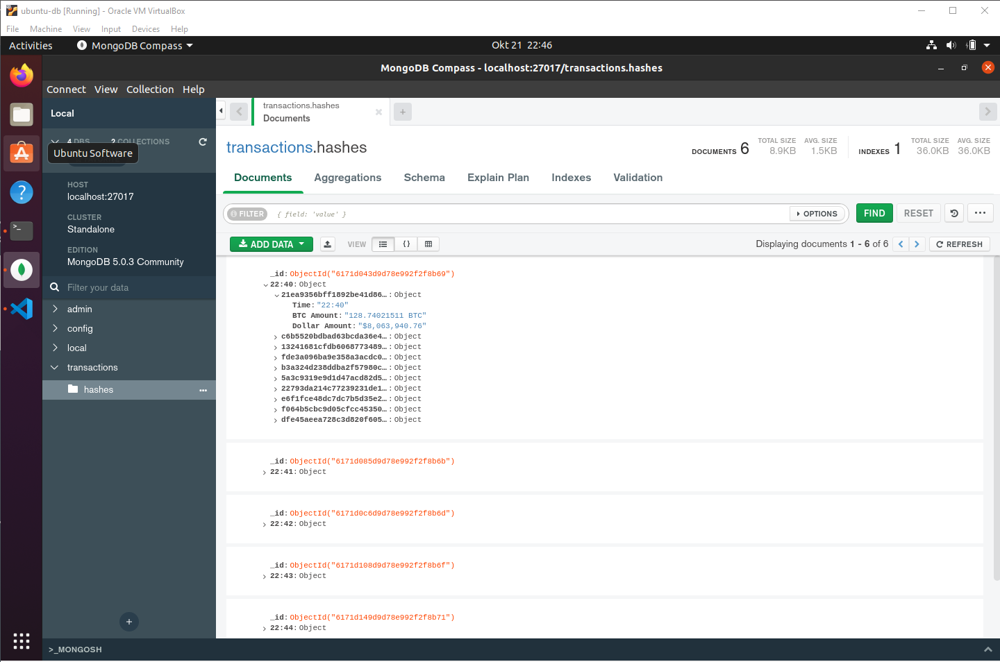

#BITCOIN TRANSACTION TRACKER

The aim of this scraper to is track and log all unconfirmed transactions from [Blockchain.com](https://www.blockchain.com/btc/unconfirmed-transactions).

The *run()* function runs the whole program from getting the data to storing and sleeping every 1 minute after storing it.

---

### Getting the data:
```        for box in soup.findAll('div', {'class': 'sc-1g6z4xm-0 hXyplo'}):
            for category in box.findAll('span', {'class': 'sc-1ryi78w-0 cILyoi sc-16b9dsl-1 ZwupP u3ufsr-0 eQTRKC'}):

                if "BTC" in category.text:
                    amounts.append(float(category.text.strip("BTC")))

        amounts = sorted(amounts, reverse=True)
```
When getting the data, the bitcoin amount is extracted and sorted in a list from highest to lowest. This is used to later
present the data in the instructed order. From there the amounts are linked back with their respective hashes and transaction times.

What was noticed was that when running the scraper, the transaction time was always 2 hours behind. So then it was edited
as follows:
```
        for ele in self.data:
            old_time_str = datetime.strptime(ele[1], "%H:%M")
            changed_time = old_time_str + time_change
            updated_time = datetime.strftime(changed_time, "%H:%M")

            ele[1] = updated_time

```
---

### Storing the data:
The data is being stored in 3 different ways. In a log file, json file, and in mongo database to keep it more organised
and make it easier to retrieve data.

A preview of how it is displayed in mongo database:

